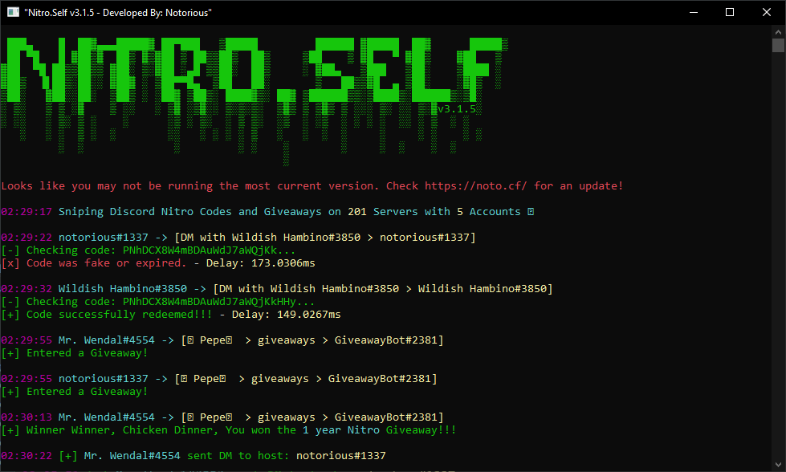

# Nitro.Self V3

[](https://github.com/noto-rious/Nitro.Self-V3/releases) [](https://github.com/noto-rious/Nitro.Self-V3/releases)

Multi-Account Discord Nitro sniper and Giveaway joiner written in Go 1.15.2.

Main Snipe functionality credit goes to <a href="https://github.com/Vedzaa">@Vedzaa</a>.  
Multi-Account threading along with code-caching for dupe protection and a few other nick-nacks are courtesy of me.

### Features 
* Supports multiple accounts.
* Redeems all codes on the main account.
* Cooldown for # hour(s) after redeeming # nitro code(s).
* Optional Nitro Giveway joiner.
* DM host with custom DM message if giveaway won.
* Removes some code obfuscation.
* Fake/duplicate code detection to avoid being banned.
* Webhook with optional support for logging fake/invalid responses and a ping user setting.



### Download & Build with Go
```
 go get https://gopkg.in/noto-rious/Nitro.Self-V3.v3
 go mod download
 go build
 ./Nitro.Self-V3
 ```
### Configure
Edit `settings.json`
```
{
  "token": "X",                            // Replace X with your main token.
  "nitro_max": 2,                          // Maximum Nitro code redeems allowed before cooldown
  "cooldown": 24,                          // How many hours to cooldown for.
  "giveaway_sniper": true,                 // Enable(true) or Disable(false) giveaway sniping or not.
  "snipe_on_main": true,                   // Enable(true) or Disable(false) sniping on the main account or not.
  "dm_host": true,                         // Enable(true) or Disable(false) the option to DM the giveaway host if you win.
  "dm_message": "hi, i won your giveaway!" // Custom DM Message.
  "webook_url": "",                        // this is optional, if you're not sure what goes here then you don't need it.
  "webook_ping_id": "",                    // this is also optional, this value would be your numerical developer user id.
  "report_fails_to_webook": false          // you can set this to true if you want to webhook log failed events.
}
```
Edit `tokens.txt`
```
NDI4Mjc31DExNzZyNTQ1NTQ2.X // Token #1
NzYxORQyMDkwNtU1NjA1PDEz.X // Token #2
NzYxODF1OikyNDEyOTE1NzKz.X // Token #2 - Add as many as you want
```
***
### How to obtain your token
**1.** Press **Ctrl+Shift+I** (⌘⌥I on Mac) on Discord to show developer tools<br/>
**2.** Navigate to the **Application** tab<br/>
**3.** Select **Local Storage** > **https://discordapp.com** on the left<br/>
**4.** Press **Ctrl+R** (⌘R) to reload<br/>
**5.** Find **token** at the bottom and copy the value<br/>
***
### Disclaimer
This is a self-bot which is against Discord ToS. Use it at your own risk.
